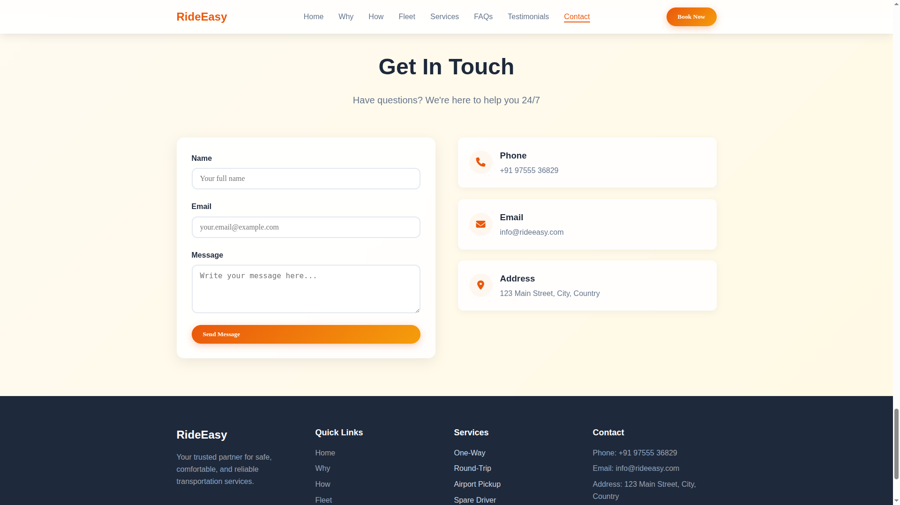

# 🚗 Ride Easy

**Ride Easy** is a simple, lightweight, and responsive **ride-booking web application** built using **HTML, CSS, and JavaScript**. The project simulates a real-world ride-hailing service interface, allowing users to enter their pickup and drop-off locations, view ride estimates, and book a ride with ease.

---

## 🌐 Live Demo

> https://aparnaraha.github.io/Ride-Easy/

---

## 📌 Features

* ✅ **Pickup & Drop-off Input**
  Users can enter starting and destination points for their ride.

* 🧮 **Fare & Time Estimation**
  Simple JavaScript logic provides estimated fare and ride duration.

* 📱 **Responsive Design**
  Mobile-first responsive layout that adjusts to all screen sizes.

* 🔍 **Form Validation**
  Basic validation to ensure users enter valid locations.

* ✨ **Clean UI/UX**
  Smooth interactions, animations, and modern interface design.

* 🧾 **Booking Summary (Optional)**
  Shows a confirmation screen summarizing the ride details.

---

## 🛠️ Tech Stack Used

| Technology                  | Purpose                                             |
| --------------------------- | --------------------------------------------------- |
| **HTML5**                   | Structuring the web pages                           |
| **CSS3**                    | Styling, layout, and responsive design              |
| **JavaScript (ES6)** | DOM manipulation, form handling, and business logic |

---

## 🗂️ Project Structure

```
ride-easy/
│
├── index.html            # Main HTML page
├── /styles
│   └── style.css         # CSS styling file
├── /scripts
│   └── script.js         # JavaScript logic
├── /assets
│   └── [images/icons]    # (Optional) media used in UI
└── README.md             # This file
```

---

## 🚀 Getting Started

Follow these steps to run the project locally on your system:

1. **Clone the repository**

   ```bash
   git clone https://github.com/Aparnaraha/Ride-Easy.git
   ```

2. **Navigate to the project folder**

   ```bash
   cd ride-easy
   ```

3. **Open `index.html` in your browser**

   * You can also use **Live Server** in VS Code for a better development experience.

4. **Done!**
   The Ride Easy interface should now be visible in your browser.

---

## 📷 Screenshots

> 




---

## 💡 Possible Future Enhancements

* 🌍 **Integrate Google Maps API** to enable real location selection
* 👤 **User Authentication** for login/logout functionality
* 🚘 **Driver Availability** showing nearby drivers in real-time
* 💳 **Payment Gateway Integration** (Stripe, Razorpay, etc.)
* 📈 **Ride History Dashboard** for viewing previous bookings
* 🌐 **Backend Integration** using Node.js or Firebase

---

## 🧪 Testing Instructions

* Ensure all form fields are filled before submitting
* Try different location combinations to see updated estimates
* Resize the browser window to test responsiveness

---

## 📄 License

This project is licensed under the [MIT License](LICENSE).
Feel free to use and modify it for your own projects!

---

## 🤝 Contributing

Contributions are welcome! Here’s how:

1. Fork the repository
2. Create a new branch (`git checkout -b feature-name`)
3. Commit your changes (`git commit -m "Added new feature"`)
4. Push to the branch (`git push origin feature-name`)
5. Open a Pull Request

---

## 🙋‍♂️ Author

**Aparna Raha** 
[GitHub](https://github.com/Aparnaraha) | [LinkedIn](https://linkedin.com/in/aparnaraha0)

---


